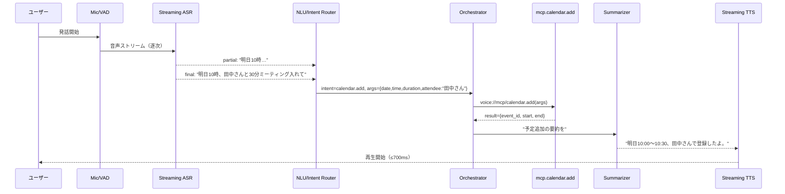
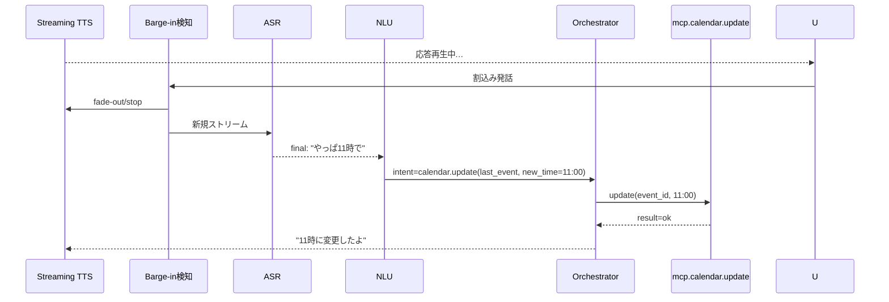
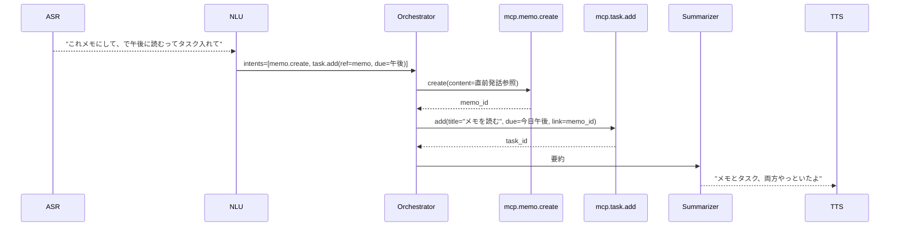

# Voice MCP Hub - 設計ドキュメント

音声アシスタントシステム「Voice MCP Hub」の設計仕様書です。

## 🧩 全体構造図（層＋音声入出力＋ユーザー設定）

```mermaid
flowchart LR
  subgraph User["👤 ユーザー"]
    Mic["🎤 マイク/イヤホン（AirPods 等）"]
    Ear["👂 再生デバイス"]
  end

  subgraph DeviceEdge["📱 デバイス側（Edge）"]
    VAD["VAD/キーワード検出"]
    ASR["Streaming ASR（部分結果対応）"]
    BargeIn["Barge-in検知（再生と割込み）"]
    LocalCache["ローカルキャッシュ/一時キュー"]
  end

  subgraph VoiceHub["🧠 Voice MCP Hub（中核）"]
    Ctx["会話/ステート管理（Session/Turn/参照）"]
    NLU["NLU/インテント解決（capability ルーティング）"]
    Orchestrator["オーケストレータ（並列/保留/再試行）"]
    Policy["権限/確認ポリシー（送信/削除時は確認）"]
    Reg["Capability レジストリ（mcp.* 登録）"]
    Cost["コスト/呼び出しレート制御"]
    Log["匿名化ログ/要約Vault"]
  end

  subgraph MCP["🔌 MCP 層（アプリ接続）"]
    Memo["🗒 memo.create/search/append"]
    Cal["📅 calendar.add/update/list"]
    Music["🎵 music.play/pause/seek"]
    Contact["💬 contact.send/call"]
    Task["✅ task.add/complete/list"]
    Map["📍 map.route/poi (統一実装)"]
    Alarm["⏰ alarm.set (OS標準)"]
    Notify["🔔 notify.push (Mypato内)"]
  end

  subgraph Output["🗣️ 出力（TTS）"]
    TTS["Streaming TTS（700ms以内に開始）"]
    Summ["結果要約/自然言語化（短く"やっといたよ"）"]
  end

  User --> Mic --> VAD --> ASR
  ASR -- partial/final --> NLU
  NLU --> Orchestrator
  Orchestrator --> Policy
  Orchestrator --> Ctx
  Orchestrator --> Reg
  Orchestrator -->|voice://mcp/<cap>| MCP
  MCP --> Orchestrator --> Summ --> TTS --> Ear
  BargeIn <-.-> TTS
  DeviceEdge <-.フォールバック.-> LocalCache
  Orchestrator --> Cost
  Orchestrator --> Log
```

## 🔁 主要シーケンス

### A) 単一アクション（例：「明日10時、田中さんと30分ミーティング入れて」）



### B) Barge-in（応答中に「やっぱ11時で」）



### C) 複数アプリ連携（例：「これメモにして、で午後に読むってタスク入れて」）



## 📦 コンポーネント責務

### デバイス側（Edge）

| コンポーネント | 責務 |
|--------------|------|
| **VAD** | 音声区間検出、キーワード検出（wake word）、発話開始/終了判定 |
| **Streaming ASR** | 音声→テキスト変換（partial/final結果の逐次送信）、低レイテンシ処理 |
| **Barge-in検知** | TTS再生中の割込み検知、音声フェードアウト制御、競合解決 |
| **LocalCache** | オフライン時のキュー保持、ネットワーク復帰時の再送 |

### Voice MCP Hub（中核）

| コンポーネント | 責務 |
|--------------|------|
| **会話/ステート管理** | セッション管理、ターン管理、コンテキスト参照（「これ」「さっきの」）の解決 |
| **NLU/インテント解決** | 発話からインテント抽出、エンティティ抽出、capability へのルーティング |
| **オーケストレータ** | 複数MCP呼び出しの並列実行、保留/再試行制御、タイムアウト管理 |
| **権限/確認ポリシー** | 送信/削除など重要操作の確認フロー、ユーザー設定に基づく権限チェック |
| **Capability レジストリ** | MCP capability の登録/発見、バージョン管理、フォールバック定義 |
| **コスト/レート制御** | API呼び出し頻度制限、コスト予算管理、優先度制御 |
| **匿名化ログ/Vault** | プライバシー保護ログ記録、要約データの暗号化保存 |

### MCP 層（アプリ接続）

| Capability | 責務 |
|-----------|------|
| **memo.*** | メモの作成/検索/追記、マークダウン対応、タグ付け |
| **calendar.*** | カレンダーイベント追加/更新/一覧取得、参加者管理 |
| **music.*** | 音楽再生/一時停止/シーク、プレイリスト操作 |
| **contact.*** | 連絡先へのメッセージ送信/通話開始 |
| **task.*** | タスク追加/完了/一覧取得、期限管理 |
| **map.*** | 経路検索/POI検索（統一実装） |
| **alarm.*** | アラーム設定（OS標準API連携） |
| **notify.*** | Mypato内プッシュ通知 |

## 🔌 API / イベント仕様

### イベントバストピック

| トピック | 説明 | ペイロード例 |
|---------|------|------------|
| `audio.in` | 音声入力ストリーム | `{session_id, chunk, timestamp}` |
| `stt.partial` | ASR部分結果 | `{session_id, text, confidence}` |
| `stt.final` | ASR最終結果 | `{session_id, text, confidence, duration}` |
| `nlu.intent` | 抽出されたインテント | `{session_id, intent, entities, confidence}` |
| `mcp.call` | MCP呼び出しリクエスト | `{call_id, capability, args, timeout}` |
| `mcp.result` | MCP呼び出し結果 | `{call_id, status, result, error}` |
| `talk.say` | TTS再生指示 | `{session_id, text, voice, priority}` |
| `policy.confirm` | 確認ダイアログ要求 | `{session_id, action, args, timeout}` |
| `policy.choice` | ユーザーの選択結果 | `{session_id, choice, timestamp}` |
| `state.update` | セッション状態更新 | `{session_id, state, context}` |

詳細な JSON Schema は [`schemas/event_bus_schema.json`](./schemas/event_bus_schema.json) を参照。

### MCP Capability API

#### calendar.add

カレンダーにイベントを追加します。

**リクエスト:**
```typescript
{
  title: string;
  start: ISO8601DateTime;
  end: ISO8601DateTime;
  attendees?: string[];
  location?: string;
  description?: string;
}
```

**レスポンス:**
```typescript
{
  event_id: string;
  start: ISO8601DateTime;
  end: ISO8601DateTime;
  status: "confirmed" | "tentative";
}
```

**実装例:** [`packages/voice-hub/calendar_add.ts`](./packages/voice-hub/calendar_add.ts)

## ⏱️ レイテンシ予算

音声アシスタントの応答性を確保するため、各コンポーネントのレイテンシ目標を定義します。

| フェーズ | 目標レイテンシ | 最大許容 | 備考 |
|---------|--------------|---------|------|
| VAD検出 | 50ms | 100ms | 発話開始の検知 |
| ASR partial | 200ms | 500ms | 最初の部分結果 |
| ASR final | 500ms | 1000ms | 発話終了後の確定 |
| NLU処理 | 100ms | 300ms | インテント抽出 |
| MCP呼び出し | 500ms | 2000ms | 外部API依存 |
| TTS開始 | 300ms | 700ms | 音声再生開始 |
| **合計（End-to-End）** | **1.2s** | **3.0s** | 発話終了→応答開始 |

### レイテンシ最適化戦略

- **Streaming ASR**: 部分結果を使った先行処理
- **並列実行**: 複数MCP呼び出しの並列化
- **キャッシング**: 頻繁に使われるデータのローカルキャッシュ
- **Barge-in**: ユーザーの割込みを即座に反映

## 🗺️ MVP ロードマップ

### Phase 1: 基盤構築（4週間）

- [ ] イベントバスアーキテクチャ実装
- [ ] 基本的な ASR/TTS パイプライン
- [ ] セッション/ステート管理
- [ ] NLU 基本実装（単一インテント）

### Phase 2: コアCapability（4週間）

- [ ] `calendar.add/update/list` 実装
- [ ] `memo.create/search` 実装
- [ ] `task.add/complete/list` 実装
- [ ] Orchestrator の並列実行サポート

### Phase 3: UX向上（3週間）

- [ ] Barge-in 実装
- [ ] 確認ポリシー実装
- [ ] コンテキスト参照（「これ」「さっきの」）
- [ ] 複数インテント連携

### Phase 4: 拡張機能（3週間）

- [ ] `music.*` capability
- [ ] `contact.*` capability
- [ ] `map.*` capability
- [ ] コスト/レート制御

### Phase 5: 本番準備（2週間）

- [ ] 匿名化ログ実装
- [ ] パフォーマンス最適化
- [ ] セキュリティ監査
- [ ] ドキュメント整備

## ✅ 受け入れ基準

### 機能要件

1. **音声認識**
   - [ ] 日本語音声の認識精度 ≥ 95%（静かな環境）
   - [ ] Streaming ASR の partial 結果が 500ms 以内に返る
   - [ ] Barge-in が 200ms 以内に検知される

2. **インテント解決**
   - [ ] 単一インテントの抽出精度 ≥ 90%
   - [ ] 複数インテント（2つ）の抽出精度 ≥ 80%
   - [ ] コンテキスト参照（「これ」）の解決率 ≥ 85%

3. **MCP連携**
   - [ ] 各 capability が 2秒以内にレスポンスを返す
   - [ ] 並列実行時の合計時間が最大値の1.2倍以内
   - [ ] エラー時の適切なフォールバック処理

4. **TTS出力**
   - [ ] 音声再生開始が ASR final から 700ms 以内
   - [ ] 自然な音声合成（主観評価 4.0/5.0 以上）
   - [ ] Barge-in 時の音声フェードアウトが滑らか

### 非機能要件

1. **パフォーマンス**
   - [ ] End-to-End レイテンシ ≤ 3秒（P95）
   - [ ] システムスループット ≥ 100 req/sec
   - [ ] CPU使用率 ≤ 60%（通常時）

2. **信頼性**
   - [ ] 稼働率 ≥ 99.5%
   - [ ] エラー率 ≤ 1%
   - [ ] 自動復旧時間 ≤ 5秒

3. **セキュリティ**
   - [ ] 音声データの暗号化（転送時・保存時）
   - [ ] 個人情報の匿名化処理
   - [ ] 権限チェックの実装（送信/削除操作）

4. **ユーザビリティ**
   - [ ] 確認ダイアログは簡潔（1文以内）
   - [ ] エラーメッセージはユーザーフレンドリー
   - [ ] 応答の口調は自然で親しみやすい

## ⚙️ デフォルト設定

### システム設定

```yaml
voice_hub:
  # セッション設定
  session:
    timeout: 300s              # セッションタイムアウト
    max_turns: 50              # 最大ターン数
    context_window: 10         # コンテキスト保持ターン数

  # レイテンシ設定
  latency:
    asr_partial_max: 500ms
    asr_final_max: 1000ms
    nlu_max: 300ms
    mcp_call_max: 2000ms
    tts_start_max: 700ms

  # 並列実行設定
  orchestrator:
    max_parallel: 5            # 最大並列MCP呼び出し数
    retry_count: 2             # リトライ回数
    retry_backoff: exponential # バックオフ戦略

  # 確認ポリシー
  policy:
    confirm_send: true         # メッセージ送信時の確認
    confirm_delete: true       # 削除時の確認
    confirm_payment: true      # 支払い時の確認
    confirm_timeout: 10s       # 確認タイムアウト

  # ログ設定
  logging:
    level: info
    anonymize: true            # 個人情報の自動匿名化
    retention: 30d             # ログ保持期間
```

### デバイス設定

```yaml
device:
  # VAD設定
  vad:
    sensitivity: 0.5           # 感度（0.0-1.0）
    speech_pad_ms: 300         # 音声前後のパディング

  # ASR設定
  asr:
    language: ja-JP
    model: streaming-v2
    interim_results: true

  # TTS設定
  tts:
    voice: ja-JP-Neural2-B
    speaking_rate: 1.0
    pitch: 0.0

  # Barge-in設定
  barge_in:
    enabled: true
    fade_duration: 200ms       # フェードアウト時間
    detection_threshold: 0.7   # 検出閾値
```

### Capability設定

```yaml
capabilities:
  calendar:
    default_duration: 60m      # デフォルト予定時間
    reminder: 15m              # デフォルトリマインダー

  memo:
    max_length: 10000          # 最大文字数
    default_format: markdown

  task:
    default_priority: medium
    auto_deadline: false       # 自動締切設定

  music:
    default_volume: 0.7
    crossfade: 3s
```

## 🔧 開発・運用

### 環境構築

```bash
# リポジトリクローン
git clone https://github.com/your-org/voice-mcp-hub.git
cd voice-mcp-hub

# 依存パッケージインストール
npm install

# 開発サーバー起動
npm run dev
```

### テスト

```bash
# 単体テスト
npm test

# 統合テスト
npm run test:integration

# E2Eテスト
npm run test:e2e
```

### デプロイ

```bash
# ビルド
npm run build

# プロダクションデプロイ
npm run deploy:prod
```

## 📚 関連ドキュメント

- [イベントバス仕様](./schemas/event_bus_schema.json)
- [MCP Capability API リファレンス](./docs/mcp-api-reference.md)
- [アーキテクチャ詳細](./docs/architecture.md)
- [運用ガイド](./docs/operations.md)

## 📄 ライセンス

MIT License

---

**Generated:** 2025-10-22
**Version:** 1.0.0
